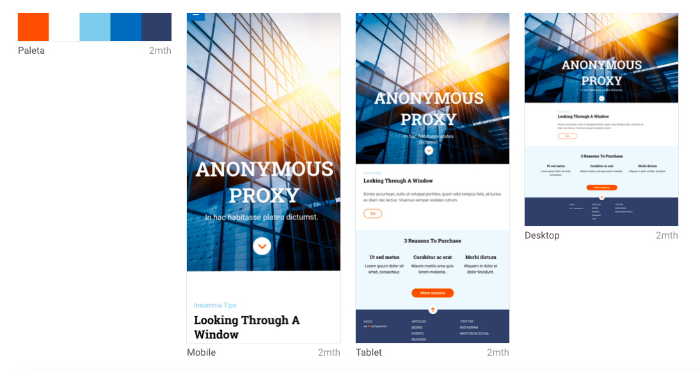
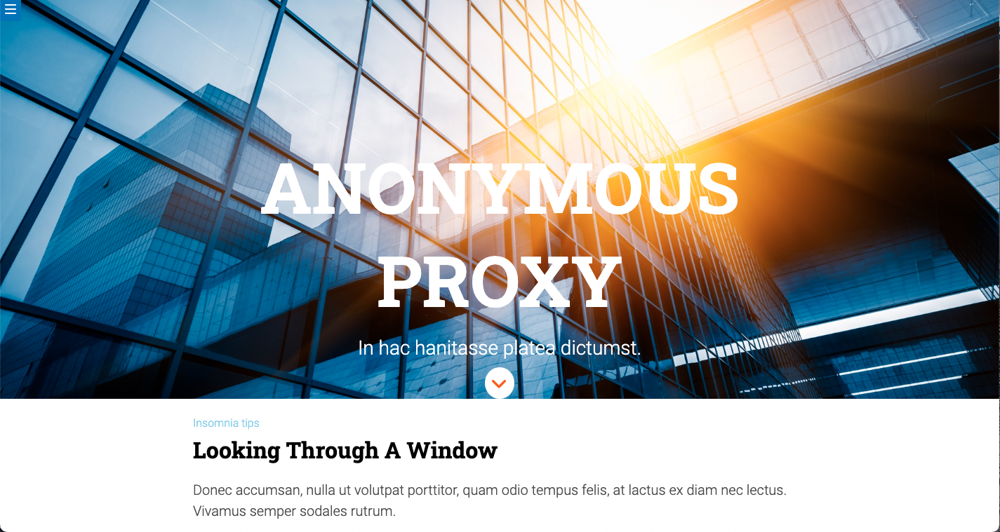

# Anonymous Proxy!

## Description

In these page I needed take the styles from a zeplin's design and add some animations.

This is de result:

## Tecnology

This project was created with:

- **HTML**
- **CSS**
- **SASS**
- **Git and GitHub Pages**

First of all to run page you will need to install npm on terminal with:

    npm install

When installation is finished, you will run page with:

    npm start

## Result

You can take a look of how it ended up in Github Pages: https://github.com/Adalab/modulo-1-evaluacion-final-Luciakestel

### Create by _Lucía Kestel_ - @Luciakestel
